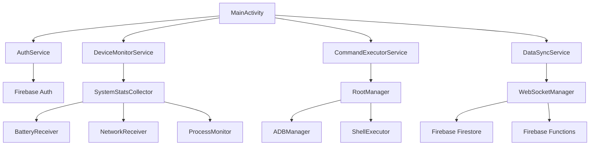

# Android Diagnostic APK - Technical Specification

## Architecture Overview

### Core Components



## 1. Service Layer Architecture

### 1.1 DeviceMonitorService

```java
@Service
public class DeviceMonitorService extends Service {
    private static final int NOTIFICATION_ID = 1001;
    private ScheduledExecutorService executor;
    private SystemStatsCollector statsCollector;
    private DataSyncService syncService;
    
    @Override
    public int onStartCommand(Intent intent, int flags, int startId) {
        createNotificationChannel();
        startForeground(NOTIFICATION_ID, createNotification());
        startMonitoring();
        return START_STICKY;
    }
    
    private void startMonitoring() {
        executor.scheduleAtFixedRate(() -> {
            DeviceMetrics metrics = statsCollector.collectMetrics();
            syncService.queueMetrics(metrics);
        }, 0, 30, TimeUnit.SECONDS);
    }
}
```

### 1.2 CommandExecutorService

```java
@Component
public class CommandExecutorService {
    private final ExecutorService executorPool = Executors.newFixedThreadPool(4);
    private final RootManager rootManager;
    private final ADBManager adbManager;
    
    public CompletableFuture<CommandResult> executeCommand(Command command) {
        return CompletableFuture.supplyAsync(() -> {
            try {
                switch (command.getType()) {
                    case SHELL:
                        return executeShellCommand(command);
                    case ADB:
                        return executeADBCommand(command);
                    case SYSTEM:
                        return executeSystemCommand(command);
                    default:
                        throw new UnsupportedOperationException("Unknown command type");
                }
            } catch (Exception e) {
                return CommandResult.error(e.getMessage());
            }
        }, executorPool);
    }
}
```

### 1.3 DataSyncService

```java
@Service
public class DataSyncService {
    private final FirebaseManager firebaseManager;
    private final LocalDatabaseManager localDb;
    private final Queue<SyncItem> syncQueue = new ConcurrentLinkedQueue<>();
    
    public void queueMetrics(DeviceMetrics metrics) {
        SyncItem item = new SyncItem(SyncType.METRICS, metrics);
        syncQueue.offer(item);
        if (isOnline()) {
            processSyncQueue();
        }
    }
    
    @Scheduled(fixedDelay = 60000) // Every minute
    public void processSyncQueue() {
        while (!syncQueue.isEmpty() && isOnline()) {
            SyncItem item = syncQueue.poll();
            try {
                firebaseManager.sync(item);
            } catch (Exception e) {
                // Re-queue with backoff
                syncQueue.offer(item);
                break;
            }
        }
    }
}
```

## 2. Data Collection Modules

### 2.1 SystemStatsCollector

```java
public class SystemStatsCollector {
    private final Context context;
    private final ActivityManager activityManager;
    private final BatteryManager batteryManager;
    private final NetworkStatsManager networkStatsManager;
    
    public DeviceMetrics collectMetrics() {
        return DeviceMetrics.builder()
            .timestamp(System.currentTimeMillis())
            .cpuUsage(getCPUUsage())
            .memoryInfo(getMemoryInfo())
            .batteryInfo(getBatteryInfo())
            .networkStats(getNetworkStats())
            .runningProcesses(getRunningProcesses())
            .installedApps(getInstalledApps())
            .build();
    }
    
    private double getCPUUsage() {
        try {
            RandomAccessFile reader = new RandomAccessFile("/proc/stat", "r");
            String load = reader.readLine();
            String[] toks = load.split(" ");
            
            long idle1 = Long.parseLong(toks[4]);
            long cpu1 = Long.parseLong(toks[2]) + Long.parseLong(toks[3]);
            
            Thread.sleep(1000);
            
            reader.seek(0);
            load = reader.readLine();
            toks = load.split(" ");
            
            long idle2 = Long.parseLong(toks[4]);
            long cpu2 = Long.parseLong(toks[2]) + Long.parseLong(toks[3]);
            
            return (double)(cpu2 - cpu1) / ((cpu2 + idle2) - (cpu1 + idle1));
        } catch (Exception e) {
            return -1;
        }
    }
}
```

### 2.2 PermissionManager

```java
public class PermissionManager {
    private static final String[] REQUIRED_PERMISSIONS = {
        Manifest.permission.ACCESS_NETWORK_STATE,
        Manifest.permission.ACCESS_WIFI_STATE,
        Manifest.permission.PACKAGE_USAGE_STATS,
        Manifest.permission.SYSTEM_ALERT_WINDOW,
        // Add more as needed
    };
    
    public static class Builder {
        private final Activity activity;
        private List<String> permissions = new ArrayList<>();
        private Runnable onGranted;
        private Runnable onDenied;
        
        public Builder(Activity activity) {
            this.activity = activity;
        }
        
        public Builder requestPermissions(String... perms) {
            permissions.addAll(Arrays.asList(perms));
            return this;
        }
        
        public Builder onGranted(Runnable callback) {
            this.onGranted = callback;
            return this;
        }
        
        public void build() {
            if (hasAllPermissions()) {
                onGranted.run();
            } else {
                requestMissingPermissions();
            }
        }
    }
}
```

## 3. Root & ADB Management

### 3.1 RootManager

```java
public class RootManager {
    private boolean isRootAvailable = false;
    private boolean rootChecked = false;
    
    public synchronized boolean hasRoot() {
        if (!rootChecked) {
            checkRootAccess();
        }
        return isRootAvailable;
    }
    
    private void checkRootAccess() {
        try {
            Process process = Runtime.getRuntime().exec("su -c 'echo test'");
            int exitCode = process.waitFor();
            isRootAvailable = (exitCode == 0);
        } catch (Exception e) {
            isRootAvailable = false;
        } finally {
            rootChecked = true;
        }
    }
    
    public CommandResult executeRootCommand(String command) throws SecurityException {
        if (!hasRoot()) {
            throw new SecurityException("Root access not available");
        }
        
        try {
            Process process = Runtime.getRuntime().exec("su -c '" + command + "'");
            BufferedReader reader = new BufferedReader(new InputStreamReader(process.getInputStream()));
            StringBuilder output = new StringBuilder();
            String line;
            
            while ((line = reader.readLine()) != null) {
                output.append(line).append("\n");
            }
            
            int exitCode = process.waitFor();
            return new CommandResult(output.toString(), exitCode == 0);
            
        } catch (Exception e) {
            return CommandResult.error(e.getMessage());
        }
    }
}
```

### 3.2 ADBManager

```java
public class ADBManager {
    private static final List<String> WHITELISTED_COMMANDS = Arrays.asList(
        "dumpsys", "pm list packages", "getprop", "logcat", "bugreport"
    );
    
    public CommandResult executeADBCommand(String command) throws SecurityException {
        if (!isCommandWhitelisted(command)) {
            throw new SecurityException("Command not whitelisted: " + command);
        }
        
        try {
            ProcessBuilder pb = new ProcessBuilder("sh", "-c", "adb shell " + command);
            Process process = pb.start();
            
            StringBuilder output = new StringBuilder();
            BufferedReader reader = new BufferedReader(new InputStreamReader(process.getInputStream()));
            String line;
            
            while ((line = reader.readLine()) != null) {
                output.append(line).append("\n");
            }
            
            int exitCode = process.waitFor();
            return new CommandResult(output.toString(), exitCode == 0);
            
        } catch (Exception e) {
            return CommandResult.error(e.getMessage());
        }
    }
    
    private boolean isCommandWhitelisted(String command) {
        return WHITELISTED_COMMANDS.stream()
            .anyMatch(whitelisted -> command.trim().startsWith(whitelisted));
    }
}
```

## 4. Firebase Integration

### 4.1 FirebaseManager

```java
public class FirebaseManager {
    private FirebaseFirestore db;
    private FirebaseAuth auth;
    private FirebaseFunctions functions;
    private String deviceId;
    
    public void initialize() {
        FirebaseApp.initializeApp(context);
        db = FirebaseFirestore.getInstance();
        auth = FirebaseAuth.getInstance();
        functions = FirebaseFunctions.getInstance();
        deviceId = getDeviceId();
    }
    
    public Task<Void> syncDeviceMetrics(DeviceMetrics metrics) {
        Map<String, Object> data = new HashMap<>();
        data.put("deviceId", deviceId);
        data.put("timestamp", FieldValue.serverTimestamp());
        data.put("metrics", metrics.toMap());
        
        return db.collection("device_metrics")
            .document(deviceId + "_" + System.currentTimeMillis())
            .set(data);
    }
    
    public void listenForCommands() {
        db.collection("commands")
            .whereEqualTo("deviceId", deviceId)
            .whereEqualTo("status", "pending")
            .addSnapshotListener((snapshots, error) -> {
                if (error != null) {
                    Log.e(TAG, "Command listener error", error);
                    return;
                }
                
                for (DocumentSnapshot doc : snapshots.getDocuments()) {
                    Command command = doc.toObject(Command.class);
                    executeCommand(command);
                }
            });
    }
}
```

### 4.2 WebSocketManager

```java
public class WebSocketManager {
    private WebSocket webSocket;
    private OkHttpClient client;
    private String deviceId;
    private boolean connected = false;
    
    public void connect() {
        Request request = new Request.Builder()
            .url("wss://your-backend.firebase.com/ws")
            .addHeader("Authorization", "Bearer " + getAuthToken())
            .addHeader("Device-ID", deviceId)
            .build();
            
        webSocket = client.newWebSocket(request, new WebSocketListener() {
            @Override
            public void onOpen(WebSocket webSocket, Response response) {
                connected = true;
                sendDeviceRegistration();
            }
            
            @Override
            public void onMessage(WebSocket webSocket, String text) {
                handleIncomingMessage(text);
            }
            
            @Override
            public void onFailure(WebSocket webSocket, Throwable t, Response response) {
                connected = false;
                scheduleReconnect();
            }
        });
    }
    
    private void handleIncomingMessage(String message) {
        try {
            JSONObject json = new JSONObject(message);
            String type = json.getString("type");
            
            switch (type) {
                case "command":
                    Command command = parseCommand(json);
                    commandExecutor.executeCommand(command);
                    break;
                case "settings_update":
                    updateSettings(json.getJSONObject("settings"));
                    break;
            }
        } catch (JSONException e) {
            Log.e(TAG, "Error parsing message", e);
        }
    }
}
```

## 5. Accessibility Service Integration

### 5.1 DiagnosticAccessibilityService

```java
public class DiagnosticAccessibilityService extends AccessibilityService {
    
    @Override
    public void onAccessibilityEvent(AccessibilityEvent event) {
        if (event.getEventType() == AccessibilityEvent.TYPE_WINDOW_STATE_CHANGED) {
            captureScreenInfo(event);
        }
    }
    
    public void performUIAutomation(UIAction action) {
        switch (action.getType()) {
            case CLICK:
                performClick(action.getX(), action.getY());
                break;
            case SWIPE:
                performSwipe(action.getStartX(), action.getStartY(), 
                           action.getEndX(), action.getEndY());
                break;
            case INPUT_TEXT:
                performTextInput(action.getText());
                break;
        }
    }
    
    private void performClick(int x, int y) {
        if (Build.VERSION.SDK_INT >= Build.VERSION_CODES.N) {
            Path clickPath = new Path();
            clickPath.moveTo(x, y);
            
            GestureDescription.Builder gestureBuilder = new GestureDescription.Builder();
            gestureBuilder.addStroke(new GestureDescription.StrokeDescription(clickPath, 0, 100));
            
            dispatchGesture(gestureBuilder.build(), null, null);
        }
    }
}
```

## 6. Background Processing

### 6.1 WorkManager Integration

```java
public class DataSyncWorker extends Worker {
    public DataSyncWorker(@NonNull Context context, @NonNull WorkerParameters params) {
        super(context, params);
    }
    
    @NonNull
    @Override
    public Result doWork() {
        try {
            DataSyncService syncService = new DataSyncService(getApplicationContext());
            syncService.processSyncQueue();
            
            // Schedule next sync
            Constraints constraints = new Constraints.Builder()
                .setRequiredNetworkType(NetworkType.CONNECTED)
                .build();
                
            OneTimeWorkRequest syncWork = new OneTimeWorkRequest.Builder(DataSyncWorker.class)
                .setConstraints(constraints)
                .setInitialDelay(5, TimeUnit.MINUTES)
                .build();
                
            WorkManager.getInstance(getApplicationContext()).enqueue(syncWork);
            
            return Result.success();
        } catch (Exception e) {
            return Result.retry();
        }
    }
}
```

### 6.2 Notification Manager

```java
public class NotificationManager {
    private static final String CHANNEL_ID = "diagnostic_alerts";
    private Context context;
    
    public void createNotificationChannel() {
        if (Build.VERSION.SDK_INT >= Build.VERSION_CODES.O) {
            NotificationChannel channel = new NotificationChannel(
                CHANNEL_ID,
                "Diagnostic Alerts",
                android.app.NotificationManager.IMPORTANCE_HIGH
            );
            
            android.app.NotificationManager manager = 
                context.getSystemService(android.app.NotificationManager.class);
            manager.createNotificationChannel(channel);
        }
    }
    
    public void showAlert(AlertData alert) {
        NotificationCompat.Builder builder = new NotificationCompat.Builder(context, CHANNEL_ID)
            .setSmallIcon(R.drawable.ic_warning)
            .setContentTitle(alert.getTitle())
            .setContentText(alert.getMessage())
            .setPriority(NotificationCompat.PRIORITY_HIGH)
            .setAutoCancel(true);
            
        android.app.NotificationManager manager = 
            context.getSystemService(android.app.NotificationManager.class);
        manager.notify(alert.getId(), builder.build());
    }
}
```

## 7. Security Implementation

### 7.1 Certificate Pinning

```java
public class SecureHttpClient {
    private static final String[] PINS = {
        "sha256/AAAAAAAAAAAAAAAAAAAAAAAAAAAAAAAAAAAAAAAAAAA=",
        "sha256/BBBBBBBBBBBBBBBBBBBBBBBBBBBBBBBBBBBBBBBBBBB="
    };
    
    public static OkHttpClient createSecureClient() {
        CertificatePinner certificatePinner = new CertificatePinner.Builder()
            .add("yourdomain.com", PINS)
            .build();
            
        return new OkHttpClient.Builder()
            .certificatePinner(certificatePinner)
            .addInterceptor(new AuthInterceptor())
            .addInterceptor(new EncryptionInterceptor())
            .build();
    }
}
```

### 7.2 Data Encryption

```java
public class EncryptionHelper {
    private static final String AES_TRANSFORMATION = "AES/GCM/NoPadding";
    private static final String KEY_ALIAS = "diagnostic_key";
    
    public static String encrypt(String data) throws Exception {
        KeyGenerator keyGenerator = KeyGenerator.getInstance(KeyProperties.KEY_ALGORITHM_AES, "AndroidKeyStore");
        KeyGenParameterSpec keyGenParameterSpec = new KeyGenParameterSpec.Builder(
            KEY_ALIAS,
            KeyProperties.PURPOSE_ENCRYPT | KeyProperties.PURPOSE_DECRYPT)
            .setBlockModes(KeyProperties.BLOCK_MODE_GCM)
            .setEncryptionPaddings(KeyProperties.ENCRYPTION_PADDING_NONE)
            .build();
            
        keyGenerator.init(keyGenParameterSpec);
        SecretKey secretKey = keyGenerator.generateKey();
        
        Cipher cipher = Cipher.getInstance(AES_TRANSFORMATION);
        cipher.init(Cipher.ENCRYPT_MODE, secretKey);
        
        byte[] encryptedData = cipher.doFinal(data.getBytes());
        byte[] iv = cipher.getIV();
        
        // Combine IV and encrypted data
        byte[] combined = new byte[iv.length + encryptedData.length];
        System.arraycopy(iv, 0, combined, 0, iv.length);
        System.arraycopy(encryptedData, 0, combined, iv.length, encryptedData.length);
        
        return Base64.encodeToString(combined, Base64.DEFAULT);
    }
}
```

## 8. Testing Strategy

### 8.1 Unit Tests

```java
@RunWith(MockitoJUnitRunner.class)
public class SystemStatsCollectorTest {
    
    @Mock
    private Context mockContext;
    
    @Mock
    private ActivityManager mockActivityManager;
    
    @InjectMocks
    private SystemStatsCollector collector;
    
    @Test
    public void testCollectMetrics() {
        // Given
        when(mockContext.getSystemService(Context.ACTIVITY_SERVICE))
            .thenReturn(mockActivityManager);
            
        // When
        DeviceMetrics metrics = collector.collectMetrics();
        
        // Then
        assertThat(metrics).isNotNull();
        assertThat(metrics.getTimestamp()).isGreaterThan(0);
    }
}
```

### 8.2 Integration Tests

```java
@RunWith(AndroidJUnit4.class)
public class DataSyncServiceTest {
    
    @Rule
    public ActivityTestRule<MainActivity> activityRule = 
        new ActivityTestRule<>(MainActivity.class);
    
    @Test
    public void testDataSync() {
        // Test real sync with Firebase emulator
        DataSyncService service = new DataSyncService(
            InstrumentationRegistry.getTargetContext()
        );
        
        DeviceMetrics metrics = new DeviceMetrics.Builder()
            .cpuUsage(0.5)
            .build();
            
        service.queueMetrics(metrics);
        
        // Verify sync completed
        await().atMost(10, SECONDS).until(() -> 
            service.getSyncQueueSize() == 0);
    }
}
```

## 9. Performance Optimization

### 9.1 Memory Management

```java
public class MemoryOptimizer {
    private static final int MAX_CACHE_SIZE = 10 * 1024 * 1024; // 10MB
    
    private LruCache<String, Object> cache = new LruCache<String, Object>(MAX_CACHE_SIZE) {
        @Override
        protected int sizeOf(String key, Object value) {
            return getObjectSize(value);
        }
    };
    
    public void optimizeMemory() {
        // Clear unused references
        cache.evictAll();
        
        // Request garbage collection
        System.gc();
        
        // Trim memory if needed
        onTrimMemory(ComponentCallbacks2.TRIM_MEMORY_RUNNING_LOW);
    }
}
```

### 9.2 Battery Optimization

```java
public class BatteryOptimizer {
    
    public void optimizeForBattery() {
        // Reduce sync frequency when battery is low
        if (getBatteryLevel() < 20) {
            setSyncInterval(Duration.ofMinutes(10));
        } else {
            setSyncInterval(Duration.ofMinutes(2));
        }
        
        // Use JobScheduler for deferred tasks
        scheduleNonUrgentTasks();
    }
    
    private void scheduleNonUrgentTasks() {
        JobScheduler jobScheduler = (JobScheduler) getSystemService(Context.JOB_SCHEDULER_SERVICE);
        
        JobInfo jobInfo = new JobInfo.Builder(1001, new ComponentName(this, BackgroundJobService.class))
            .setRequiredNetworkType(JobInfo.NETWORK_TYPE_UNMETERED)
            .setRequiresCharging(true)
            .setPersisted(true)
            .build();
            
        jobScheduler.schedule(jobInfo);
    }
}
```

This technical specification provides the foundation for implementing the Android APK with all the necessary components for device monitoring, command execution, and cloud synchronization.