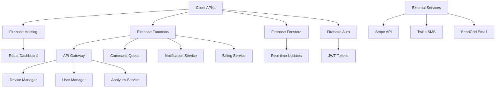

# Firebase Backend Architecture Specification

## Overview

Centralized backend infrastructure using Firebase services with Docker containerization support for scalable device management, user authentication, and real-time monitoring.

## Architecture Components



## 1. Firebase Functions Structure

### 1.1 API Gateway Function

```javascript
// functions/src/index.js
const functions = require('firebase-functions');
const express = require('express');
const cors = require('cors');
const { authMiddleware } = require('./middleware/auth');
const { rateLimitMiddleware } = require('./middleware/rateLimit');

const app = express();

app.use(cors({ origin: true }));
app.use(express.json({ limit: '10mb' }));
app.use(rateLimitMiddleware);

// Routes
app.use('/auth', require('./routes/auth'));
app.use('/devices', authMiddleware, require('./routes/devices'));
app.use('/commands', authMiddleware, require('./routes/commands'));
app.use('/monitoring', authMiddleware, require('./routes/monitoring'));
app.use('/notifications', authMiddleware, require('./routes/notifications'));
app.use('/billing', authMiddleware, require('./routes/billing'));

exports.api = functions.https.onRequest(app);
```

### 1.2 Device Management Functions

```javascript
// functions/src/services/DeviceManager.js
class DeviceManager {
  constructor(db, auth) {
    this.db = db;
    this.auth = auth;
  }

  async registerDevice(userId, deviceInfo) {
    const deviceId = this.generateDeviceId();
    const device = {
      deviceId,
      userId,
      ...deviceInfo,
      status: 'online',
      registeredAt: admin.firestore.FieldValue.serverTimestamp(),
      lastSeen: admin.firestore.FieldValue.serverTimestamp(),
      settings: {
        syncInterval: 60000, // 1 minute
        alertsEnabled: true,
        autoOptimization: false
      }
    };

    await this.db.collection('devices').doc(deviceId).set(device);
    
    // Update user device count
    await this.updateUserDeviceCount(userId, 1);
    
    return { deviceId, device };
  }

  async updateDeviceMetrics(deviceId, metrics) {
    const batch = this.db.batch();
    
    // Update device document
    const deviceRef = this.db.collection('devices').doc(deviceId);
    batch.update(deviceRef, {
      'metrics': metrics,
      'lastSeen': admin.firestore.FieldValue.serverTimestamp(),
      'status': 'online'
    });
    
    // Add to metrics collection for historical data
    const metricsRef = this.db.collection('device_metrics').doc();
    batch.set(metricsRef, {
      deviceId,
      timestamp: admin.firestore.FieldValue.serverTimestamp(),
      ...metrics
    });
    
    await batch.commit();
    
    // Check for alerts
    await this.checkMetricAlerts(deviceId, metrics);
  }

  async checkMetricAlerts(deviceId, metrics) {
    const device = await this.db.collection('devices').doc(deviceId).get();
    const user = await this.db.collection('users').doc(device.data().userId).get();
    const alertRules = user.data().settings?.alertRules || [];
    
    for (const rule of alertRules) {
      if (this.evaluateAlertRule(rule, metrics)) {
        await this.triggerAlert(device.data(), rule, metrics);
      }
    }
  }

  evaluateAlertRule(rule, metrics) {
    switch (rule.type) {
      case 'cpu_high':
        return metrics.cpuUsage > rule.threshold;
      case 'memory_low':
        return metrics.memoryInfo.availablePercent < rule.threshold;
      case 'battery_low':
        return metrics.batteryInfo.level < rule.threshold;
      case 'storage_low':
        return metrics.storageInfo.availablePercent < rule.threshold;
      default:
        return false;
    }
  }
}

module.exports = DeviceManager;
```

### 1.3 Command Queue System

```javascript
// functions/src/services/CommandQueue.js
class CommandQueue {
  constructor(db) {
    this.db = db;
  }

  async enqueueCommand(deviceId, userId, command) {
    const commandDoc = {
      commandId: this.generateCommandId(),
      deviceId,
      userId,
      command: command.command,
      type: command.type,
      parameters: command.parameters || {},
      status: 'pending',
      createdAt: admin.firestore.FieldValue.serverTimestamp(),
      priority: command.priority || 'normal',
      timeout: command.timeout || 30000
    };

    await this.db.collection('commands').doc(commandDoc.commandId).set(commandDoc);
    
    // Notify device via WebSocket or FCM
    await this.notifyDevice(deviceId, commandDoc);
    
    return commandDoc;
  }

  async updateCommandStatus(commandId, status, result = null, error = null) {
    const updateData = {
      status,
      updatedAt: admin.firestore.FieldValue.serverTimestamp()
    };

    if (result) updateData.result = result;
    if (error) updateData.error = error;
    if (status === 'completed') {
      updateData.completedAt = admin.firestore.FieldValue.serverTimestamp();
    }

    await this.db.collection('commands').doc(commandId).update(updateData);
  }

  async getDeviceCommands(deviceId, status = 'pending') {
    const snapshot = await this.db.collection('commands')
      .where('deviceId', '==', deviceId)
      .where('status', '==', status)
      .orderBy('createdAt', 'asc')
      .limit(10)
      .get();

    return snapshot.docs.map(doc => ({ id: doc.id, ...doc.data() }));
  }

  // Scheduled function to cleanup old commands
  async cleanupOldCommands() {
    const cutoffDate = new Date(Date.now() - 7 * 24 * 60 * 60 * 1000); // 7 days ago
    const snapshot = await this.db.collection('commands')
      .where('createdAt', '<', cutoffDate)
      .get();

    const batch = this.db.batch();
    snapshot.docs.forEach(doc => batch.delete(doc.ref));
    await batch.commit();
  }
}

// Scheduled function
exports.cleanupCommands = functions.pubsub.schedule('0 2 * * *') // Daily at 2 AM
  .onRun(async () => {
    const commandQueue = new CommandQueue(admin.firestore());
    await commandQueue.cleanupOldCommands();
  });
```

### 1.4 Notification Service

```javascript
// functions/src/services/NotificationService.js
const admin = require('firebase-admin');
const twilio = require('twilio');
const sgMail = require('@sendgrid/mail');

class NotificationService {
  constructor() {
    this.twilioClient = twilio(
      functions.config().twilio.account_sid,
      functions.config().twilio.auth_token
    );
    sgMail.setApiKey(functions.config().sendgrid.api_key);
  }

  async sendPushNotification(deviceTokens, notification) {
    const message = {
      notification: {
        title: notification.title,
        body: notification.body,
        icon: notification.icon || 'default'
      },
      data: notification.data || {},
      tokens: deviceTokens
    };

    try {
      const response = await admin.messaging().sendMulticast(message);
      console.log('Push notification sent:', response.successCount);
      return response;
    } catch (error) {
      console.error('Push notification error:', error);
      throw error;
    }
  }

  async sendSMSNotification(phoneNumber, message) {
    try {
      const result = await this.twilioClient.messages.create({
        body: message,
        from: functions.config().twilio.phone_number,
        to: phoneNumber
      });
      return result;
    } catch (error) {
      console.error('SMS notification error:', error);
      throw error;
    }
  }

  async sendEmailNotification(email, subject, content) {
    const msg = {
      to: email,
      from: functions.config().sendgrid.from_email,
      subject: subject,
      html: content
    };

    try {
      const result = await sgMail.send(msg);
      return result;
    } catch (error) {
      console.error('Email notification error:', error);
      throw error;
    }
  }

  async processAlert(userId, deviceId, alert) {
    const user = await admin.firestore().collection('users').doc(userId).get();
    const userData = user.data();
    const device = await admin.firestore().collection('devices').doc(deviceId).get();
    const deviceData = device.data();

    if (!userData.settings?.notifications) return;

    const alertMessage = this.formatAlertMessage(alert, deviceData);

    // Send push notification
    if (userData.fcmTokens?.length > 0) {
      await this.sendPushNotification(userData.fcmTokens, {
        title: `Alert: ${deviceData.name}`,
        body: alertMessage,
        data: { deviceId, alertType: alert.type }
      });
    }

    // Send SMS for critical alerts (premium users only)
    if (alert.severity === 'critical' && 
        userData.subscription?.plan !== 'free' && 
        userData.phoneNumber) {
      await this.sendSMSNotification(userData.phoneNumber, alertMessage);
    }

    // Send email for all alerts (if enabled)
    if (userData.email && userData.settings?.emailNotifications) {
      await this.sendEmailNotification(
        userData.email,
        `Device Alert: ${deviceData.name}`,
        this.generateAlertEmailHTML(alert, deviceData)
      );
    }
  }
}

module.exports = NotificationService;
```

### 1.5 Billing & Subscription Service

```javascript
// functions/src/services/BillingService.js
const stripe = require('stripe')(functions.config().stripe.secret_key);

class BillingService {
  constructor(db) {
    this.db = db;
  }

  async createCustomer(userId, email, name) {
    const customer = await stripe.customers.create({
      email,
      name,
      metadata: { userId }
    });

    await this.db.collection('users').doc(userId).update({
      stripeCustomerId: customer.id
    });

    return customer;
  }

  async createSubscription(userId, priceId) {
    const user = await this.db.collection('users').doc(userId).get();
    const userData = user.data();

    if (!userData.stripeCustomerId) {
      throw new Error('Customer not found');
    }

    const subscription = await stripe.subscriptions.create({
      customer: userData.stripeCustomerId,
      items: [{ price: priceId }],
      payment_behavior: 'default_incomplete',
      expand: ['latest_invoice.payment_intent'],
    });

    await this.db.collection('subscriptions').doc(subscription.id).set({
      userId,
      subscriptionId: subscription.id,
      status: subscription.status,
      priceId,
      currentPeriodStart: new Date(subscription.current_period_start * 1000),
      currentPeriodEnd: new Date(subscription.current_period_end * 1000),
      createdAt: admin.firestore.FieldValue.serverTimestamp()
    });

    return subscription;
  }

  async handleWebhook(signature, payload) {
    const event = stripe.webhooks.constructEvent(
      payload,
      signature,
      functions.config().stripe.webhook_secret
    );

    switch (event.type) {
      case 'customer.subscription.updated':
      case 'customer.subscription.deleted':
        await this.updateSubscriptionStatus(event.data.object);
        break;
      case 'invoice.payment_succeeded':
        await this.handlePaymentSuccess(event.data.object);
        break;
      case 'invoice.payment_failed':
        await this.handlePaymentFailure(event.data.object);
        break;
    }
  }

  async updateSubscriptionStatus(subscription) {
    await this.db.collection('subscriptions').doc(subscription.id).update({
      status: subscription.status,
      currentPeriodEnd: new Date(subscription.current_period_end * 1000),
      updatedAt: admin.firestore.FieldValue.serverTimestamp()
    });

    // Update user subscription info
    const subDoc = await this.db.collection('subscriptions').doc(subscription.id).get();
    const userId = subDoc.data().userId;
    
    await this.db.collection('users').doc(userId).update({
      'subscription.status': subscription.status,
      'subscription.currentPeriodEnd': new Date(subscription.current_period_end * 1000)
    });
  }
}

module.exports = BillingService;
```

## 2. Firestore Database Structure

### 2.1 Collections Schema

```javascript
// Firestore Collections Structure

// users/{userId}
{
  uid: "string",
  email: "string", 
  displayName: "string",
  photoURL: "string",
  phoneNumber: "string",
  subscription: {
    plan: "free|pro|business|enterprise",
    status: "active|canceled|past_due",
    currentPeriodEnd: "timestamp",
    deviceLimit: "number",
    features: ["string"]
  },
  settings: {
    notifications: "boolean",
    emailNotifications: "boolean",
    smsNotifications: "boolean",
    alertRules: [{
      id: "string",
      name: "string", 
      type: "cpu_high|memory_low|battery_low|storage_low",
      threshold: "number",
      enabled: "boolean",
      devices: ["string"] // device IDs
    }]
  },
  fcmTokens: ["string"],
  stripeCustomerId: "string",
  createdAt: "timestamp",
  updatedAt: "timestamp"
}

// devices/{deviceId}  
{
  deviceId: "string",
  userId: "string",
  name: "string",
  model: "string",
  manufacturer: "string",
  androidVersion: "string",
  apiLevel: "number",
  serialNumber: "string",
  imei: "string",
  status: "online|offline|maintenance",
  location: {
    latitude: "number",
    longitude: "number",
    address: "string",
    updatedAt: "timestamp"
  },
  capabilities: {
    root: "boolean",
    adb: "boolean", 
    accessibility: "boolean",
    deviceAdmin: "boolean",
    systemApps: "boolean"
  },
  metrics: {
    cpuUsage: "number", // percentage
    memoryInfo: {
      total: "number", // MB
      used: "number", // MB
      available: "number", // MB
      availablePercent: "number"
    },
    batteryInfo: {
      level: "number", // percentage
      isCharging: "boolean",
      health: "string",
      temperature: "number"
    },
    storageInfo: {
      internal: {
        total: "number", // GB
        used: "number", // GB
        available: "number" // GB
      },
      external: {
        total: "number",
        used: "number", 
        available: "number"
      }
    },
    networkInfo: {
      type: "wifi|cellular|ethernet",
      isConnected: "boolean",
      signalStrength: "number",
      downloadSpeed: "number", // Mbps
      uploadSpeed: "number" // Mbps
    }
  },
  settings: {
    syncInterval: "number", // milliseconds
    alertsEnabled: "boolean",
    autoOptimization: "boolean",
    debugMode: "boolean"
  },
  registeredAt: "timestamp",
  lastSeen: "timestamp"
}

// device_metrics/{metricId}
{
  deviceId: "string",
  timestamp: "timestamp",
  cpuUsage: "number",
  memoryInfo: "object",
  batteryInfo: "object",
  storageInfo: "object",
  networkInfo: "object",
  runningProcesses: "number",
  installedApps: "number"
}

// commands/{commandId}
{
  commandId: "string",
  deviceId: "string", 
  userId: "string",
  type: "shell|adb|system|custom",
  command: "string",
  parameters: "object",
  status: "pending|executing|completed|failed|timeout",
  priority: "low|normal|high|critical",
  result: "string",
  error: "string",
  timeout: "number", // milliseconds
  createdAt: "timestamp",
  startedAt: "timestamp",
  completedAt: "timestamp"
}

// activities/{activityId}
{
  activityId: "string",
  userId: "string",
  deviceId: "string", 
  type: "command|alert|sync|login|settings",
  action: "string",
  details: "object",
  metadata: "object",
  timestamp: "timestamp"
}

// subscriptions/{subscriptionId}
{
  userId: "string",
  subscriptionId: "string", // Stripe subscription ID
  customerId: "string", // Stripe customer ID
  priceId: "string",
  status: "string",
  currentPeriodStart: "timestamp",
  currentPeriodEnd: "timestamp",
  cancelAtPeriodEnd: "boolean",
  createdAt: "timestamp",
  updatedAt: "timestamp"
}

// alerts/{alertId}
{
  alertId: "string",
  userId: "string",
  deviceId: "string",
  type: "string",
  severity: "low|medium|high|critical", 
  title: "string",
  message: "string",
  acknowledged: "boolean",
  resolvedAt: "timestamp",
  createdAt: "timestamp"
}
```

### 2.2 Security Rules

```javascript
// firestore.rules
rules_version = '2';
service cloud.firestore {
  match /databases/{database}/documents {
    
    // Users can only access their own data
    match /users/{userId} {
      allow read, write: if request.auth != null && request.auth.uid == userId;
    }
    
    // Devices can only be accessed by their owners
    match /devices/{deviceId} {
      allow read, write: if request.auth != null && 
        resource.data.userId == request.auth.uid;
      allow create: if request.auth != null &&
        request.resource.data.userId == request.auth.uid;
    }
    
    // Device metrics can be written by device owners
    match /device_metrics/{metricId} {
      allow read, write: if request.auth != null &&
        exists(/databases/$(database)/documents/devices/$(resource.data.deviceId)) &&
        get(/databases/$(database)/documents/devices/$(resource.data.deviceId)).data.userId == request.auth.uid;
    }
    
    // Commands can be created by device owners and read by devices
    match /commands/{commandId} {
      allow read, write: if request.auth != null && (
        resource.data.userId == request.auth.uid ||
        (exists(/databases/$(database)/documents/devices/$(resource.data.deviceId)) &&
         get(/databases/$(database)/documents/devices/$(resource.data.deviceId)).data.userId == request.auth.uid)
      );
    }
    
    // Activities can only be accessed by their owners
    match /activities/{activityId} {
      allow read, write: if request.auth != null && 
        resource.data.userId == request.auth.uid;
    }
    
    // Subscriptions can only be accessed by their owners
    match /subscriptions/{subscriptionId} {
      allow read: if request.auth != null && 
        resource.data.userId == request.auth.uid;
      allow write: if false; // Only backend can write
    }
    
    // Alerts can only be accessed by their owners
    match /alerts/{alertId} {
      allow read, write: if request.auth != null && 
        resource.data.userId == request.auth.uid;
    }
  }
}
```

## 3. Docker Configuration

### 3.1 Docker Compose for Development

```yaml
# docker-compose.dev.yml
version: '3.8'

services:
  firebase-emulator:
    build:
      context: .
      dockerfile: Dockerfile.firebase
    ports:
      - "4000:4000"   # Emulator UI
      - "9000:9000"   # Auth
      - "8080:8080"   # Firestore
      - "9199:9199"   # Storage
      - "5001:5001"   # Functions
      - "8085:8085"   # Pub/Sub
      - "9299:9299"   # Database
    volumes:
      - ./functions:/workspace/functions
      - ./firebase.json:/workspace/firebase.json
      - ./firestore.rules:/workspace/firestore.rules
      - ./firestore.indexes.json:/workspace/firestore.indexes.json
    environment:
      - GOOGLE_APPLICATION_CREDENTIALS=/workspace/serviceAccountKey.json
    command: >
      sh -c "cd /workspace && 
             npm install -g firebase-tools &&
             firebase emulators:start --project demo-project --import=./data"

  redis:
    image: redis:7-alpine
    ports:
      - "6379:6379"
    volumes:
      - redis-data:/data
    command: redis-server --appendonly yes

  postgres:
    image: postgres:14
    ports:
      - "5432:5432"
    environment:
      POSTGRES_DB: android_diagnostic
      POSTGRES_USER: admin
      POSTGRES_PASSWORD: password
    volumes:
      - postgres-data:/var/lib/postgresql/data
      - ./sql:/docker-entrypoint-initdb.d

  monitoring:
    image: prom/prometheus:latest
    ports:
      - "9090:9090"
    volumes:
      - ./monitoring/prometheus.yml:/etc/prometheus/prometheus.yml
    command:
      - '--config.file=/etc/prometheus/prometheus.yml'
      - '--storage.tsdb.path=/prometheus'

  grafana:
    image: grafana/grafana:latest
    ports:
      - "3000:3000"
    environment:
      - GF_SECURITY_ADMIN_PASSWORD=admin
    volumes:
      - grafana-data:/var/lib/grafana
      - ./monitoring/grafana/dashboards:/etc/grafana/provisioning/dashboards
      - ./monitoring/grafana/datasources:/etc/grafana/provisioning/datasources

volumes:
  redis-data:
  postgres-data:
  grafana-data:
```

### 3.2 Production Dockerfile

```dockerfile
# Dockerfile.firebase
FROM node:18-alpine

WORKDIR /workspace

# Install Firebase CLI
RUN npm install -g firebase-tools

# Copy Firebase configuration
COPY firebase.json ./
COPY firestore.rules ./
COPY firestore.indexes.json ./

# Copy and install function dependencies
COPY functions/package*.json ./functions/
RUN cd functions && npm install

# Copy function source
COPY functions/src ./functions/src

# Copy service account key (for emulator)
COPY serviceAccountKey.json ./

EXPOSE 4000 5001 8080 9000 9199

CMD ["firebase", "emulators:start", "--project", "demo-project"]
```

## 4. Cloud Run Deployment

### 4.1 Cloud Run Service Configuration

```yaml
# cloudrun.yaml
apiVersion: serving.knative.dev/v1
kind: Service
metadata:
  name: android-diagnostic-api
  annotations:
    run.googleapis.com/ingress: all
    run.googleapis.com/ingress-status: all
spec:
  template:
    metadata:
      annotations:
        autoscaling.knative.dev/minScale: "1"
        autoscaling.knative.dev/maxScale: "100"
        run.googleapis.com/cpu-throttling: "false"
        run.googleapis.com/memory: "2Gi"
        run.googleapis.com/cpu: "2"
    spec:
      containers:
      - image: gcr.io/PROJECT_ID/android-diagnostic-backend:latest
        ports:
        - containerPort: 8080
        env:
        - name: NODE_ENV
          value: "production"
        - name: FIREBASE_PROJECT_ID
          value: "your-project-id"
        resources:
          limits:
            memory: "2Gi"
            cpu: "2000m"
          requests:
            memory: "1Gi" 
            cpu: "1000m"
```

### 4.2 GitHub Actions Deployment

```yaml
# .github/workflows/deploy.yml
name: Deploy to Firebase and Cloud Run

on:
  push:
    branches: [main]

jobs:
  deploy:
    runs-on: ubuntu-latest
    
    steps:
    - uses: actions/checkout@v3
    
    - name: Setup Node.js
      uses: actions/setup-node@v3
      with:
        node-version: '18'
        cache: 'npm'
    
    - name: Install dependencies
      run: |
        cd functions
        npm install
        
    - name: Build functions
      run: |
        cd functions
        npm run build
        
    - name: Setup Google Cloud
      uses: google-github-actions/setup-gcloud@v0
      with:
        service_account_key: ${{ secrets.GCP_SA_KEY }}
        project_id: ${{ secrets.GCP_PROJECT_ID }}
        
    - name: Deploy to Firebase
      run: |
        npm install -g firebase-tools
        firebase deploy --only functions,firestore,hosting --token ${{ secrets.FIREBASE_TOKEN }}
        
    - name: Deploy to Cloud Run
      run: |
        gcloud builds submit --tag gcr.io/${{ secrets.GCP_PROJECT_ID }}/android-diagnostic-backend
        gcloud run deploy android-diagnostic-api \
          --image gcr.io/${{ secrets.GCP_PROJECT_ID }}/android-diagnostic-backend \
          --platform managed \
          --region us-central1 \
          --allow-unauthenticated \
          --memory 2Gi \
          --cpu 2
```

## 5. Monitoring & Logging

### 5.1 Application Monitoring

```javascript
// functions/src/middleware/monitoring.js
const { Logging } = require('@google-cloud/logging');
const logging = new Logging();

class MonitoringService {
  constructor() {
    this.log = logging.log('android-diagnostic');
  }

  logApiCall(req, res, duration) {
    const entry = this.log.entry({
      resource: { type: 'cloud_function', labels: { function_name: 'api' } },
      severity: 'INFO'
    }, {
      method: req.method,
      url: req.originalUrl,
      userAgent: req.get('User-Agent'),
      ip: req.ip,
      userId: req.user?.uid,
      statusCode: res.statusCode,
      duration: duration,
      timestamp: new Date().toISOString()
    });

    this.log.write(entry);
  }

  logError(error, context) {
    const entry = this.log.entry({
      resource: { type: 'cloud_function' },
      severity: 'ERROR'
    }, {
      message: error.message,
      stack: error.stack,
      context: context,
      timestamp: new Date().toISOString()
    });

    this.log.write(entry);
  }

  async recordMetric(metricName, value, labels = {}) {
    // Send to Cloud Monitoring
    const monitoring = require('@google-cloud/monitoring');
    const client = new monitoring.MetricServiceClient();
    
    const request = {
      name: client.projectPath(process.env.GOOGLE_CLOUD_PROJECT),
      timeSeries: [{
        metric: {
          type: `custom.googleapis.com/${metricName}`,
          labels: labels
        },
        resource: {
          type: 'global',
          labels: {
            project_id: process.env.GOOGLE_CLOUD_PROJECT
          }
        },
        points: [{
          interval: {
            endTime: { seconds: Date.now() / 1000 }
          },
          value: { doubleValue: value }
        }]
      }]
    };

    await client.createTimeSeries(request);
  }
}

module.exports = MonitoringService;
```

## 6. Caching Strategy

### 6.1 Redis Integration

```javascript
// functions/src/services/CacheService.js
const redis = require('redis');

class CacheService {
  constructor() {
    this.client = redis.createClient({
      host: process.env.REDIS_HOST || 'localhost',
      port: process.env.REDIS_PORT || 6379,
      password: process.env.REDIS_PASSWORD
    });
  }

  async get(key) {
    try {
      const value = await this.client.get(key);
      return value ? JSON.parse(value) : null;
    } catch (error) {
      console.error('Cache get error:', error);
      return null;
    }
  }

  async set(key, value, ttl = 3600) {
    try {
      await this.client.setex(key, ttl, JSON.stringify(value));
    } catch (error) {
      console.error('Cache set error:', error);
    }
  }

  async del(key) {
    try {
      await this.client.del(key);
    } catch (error) {
      console.error('Cache delete error:', error);
    }
  }

  async invalidatePattern(pattern) {
    try {
      const keys = await this.client.keys(pattern);
      if (keys.length > 0) {
        await this.client.del(keys);
      }
    } catch (error) {
      console.error('Cache invalidate error:', error);
    }
  }
}

module.exports = CacheService;
```

This Firebase backend specification provides a comprehensive foundation for the centralized backend infrastructure, supporting user authentication, device management, real-time monitoring, billing, and scalable deployment options.